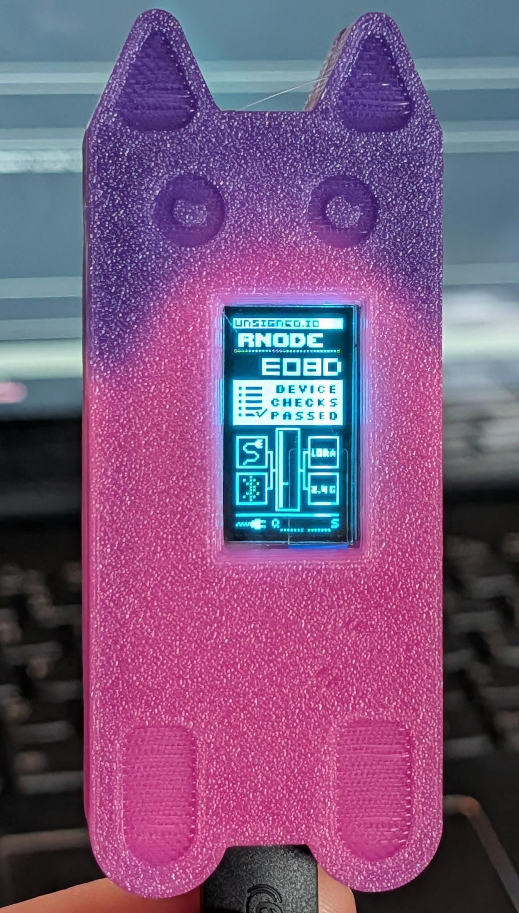
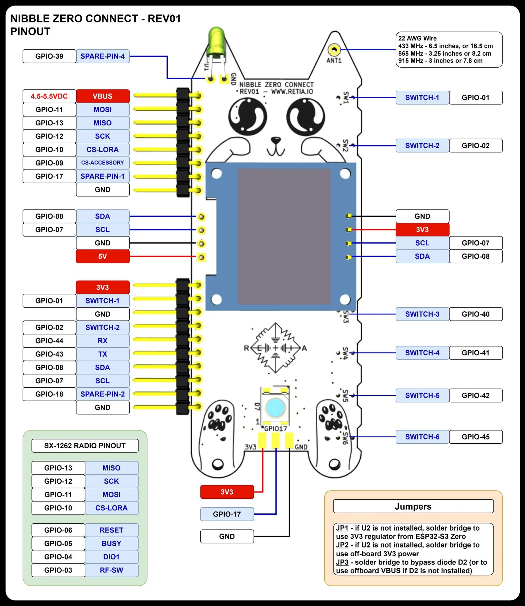

# Retia Nibble Zero - RNode Firmware & Tools



This repository contains the firmware, setup scripts, and automated flashing tools for the **Retia Nibble Zero** (ESP32-S3 based RNode).

## Quick Start (Flashing)
To flash your Nibble Zero with the latest firmware:

1. **Clone the repo**:
   ```bash
   git clone https://github.com/bwasserm/RNode_Firmware_Nibble.git
   cd RNode_Firmware_Nibble
   ```
2. **Run the automated flasher**:
   ```bash
   ./Release/flash_nibble.sh /dev/ttyACM0
   ```

## Key Features
- **Automated Flashing**: Software-triggered bootloader mode (no physical buttons required).
- **OLED Support**: SSD1306 display active on pins 7 (SCL) and 8 (SDA).
- **LoRa Performance**: Pre-configured for SX1262 modem.
- **Factory Bin**: Single-pass `factory.bin` for rapid deployment.

## Contents
- **`Stable_OLED/`**: Latest stable firmware binaries and automated scripts.
- **`RNode_Firmware/`**: Source code for the RNode firmware (Nibble branch).
- **`GUIDE.md`**: Detailed flashing and manual setup guide.
- **`DEVELOPER.md`**: Build instructions and board configuration details.
- **`setup_nibble_zero.sh`**: Environment setup script for Kali/Linux.

## Verification
Use the included `test_link.sh` (requires 2 devices) to verify RF communication:
```bash
./Release/test_link.sh /dev/ttyACM0 /dev/ttyACM1
```

## Hardware Specifications


- **MCU**: ESP32-S3
- **LoRa**: SX1262
- **Display**: SSD1306 (I2C)
- **Identity**: Hombrew RNode (f0:fe:ff)
